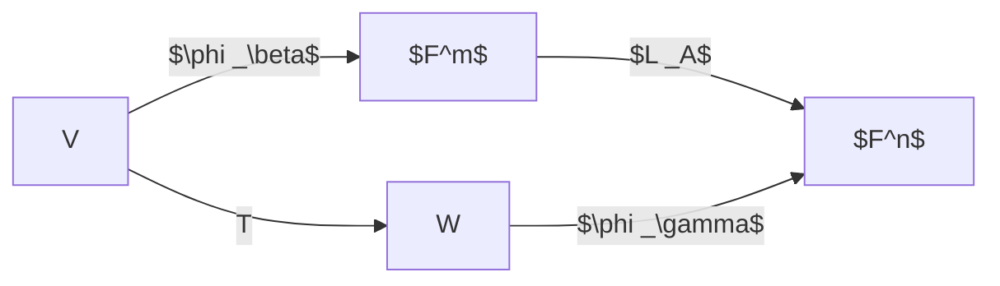

# 2019-9-9

听不清啊啊啊啊啊
有条件的话下回找个靠前的位置

### Many important applications

very limitted examples:
- quantum machanics
input: 2d-vector
gate: mul a matrix
- graph
adj matrix
- rotate a vector
mul a matrix

### Overall introduction

- System of linear equations
- Vector space
- Linear transformation
- Matrices and proportions of matrices
- Determinants
- Diagonal???（应该是对角化？） 
- Linear product space
- Jordan canonical form

### Chapter 1
#### Sec.1 System of linear equations

应该就是线性方程组吧
$$
\begin{aligned}
x _1+a _{12}x _2=t _1\\
x _1+a _{22}x _2=t _2
\end{aligned}
$$
可以写成
$$
\begin{aligned}
x _1=t _1-a _{12}x _2\\
x _1=t _2-a _{22}x _2
\end{aligned}
$$
plot them
$\Rightarrow$0，1或无穷个解
equivalent$\Leftrightarrow$have the same solution set
更大的方程？
$$
\begin{aligned}
a _{11}x _1+a _{12}x _2+\cdots+a _{1n}x _n=b _1\\
\cdots
\end{aligned}
$$
可以写成
$$
\begin{pmatrix}
a _{11}&a _{12}&\cdots&a _{1n}\\
a _{21}&a _{22}&\cdots&a _{2n}\\
\vdots&\vdots&\ddots&\vdots\\
a _{n1}&a _{n2}&\cdots&a _{nn}
\end{pmatrix}
\begin{pmatrix}
x _1\\
x _2\\
\vdots\\
x _n
\end{pmatrix}
=\begin{pmatrix}
y _1\\
y _2\\
\vdots\\
y _n
\end{pmatrix}
$$
$n\times n,n\times 1,n\times 1$
how to solve a linear system?
$$
\begin{pmatrix}
a _{11}&a _{12}&\cdots&a _{1n}&y _1\\
\cdots\\
a _{n1}&a _{n2}&\cdots&a _{nn}&y _n
\end{pmatrix}
$$
高斯消元？
- replacement
- interchange
- scaling

本质上其实也是对A求逆？
leading entry$\Leftrightarrow$leftmost non-zero entry
echelon form
basic variable$\Leftrightarrow$locating at the position of a leading entry
otherwise free variable
existence of a solution to a linear system:
- augumented matrix
- $\Rightarrow$reduced echelon form
	- $\begin{pmatrix}
	\cdots\\
	0&0&\cdots&0&t
	\end{pmatrix}(t\neq 0)\Rightarrow$no solution
	- does free variables exist?
		- yes$\Rightarrow\infty$
		- no$\Rightarrow 1$

#### Vector space(?)

$$
\begin{aligned}
\begin{pmatrix}
a _{11}&a _{12}\\
a _{21}&a _{22}
\end{pmatrix}
\begin{pmatrix}
x _1\\
x _2
\end{pmatrix}
=\begin{pmatrix}
y _1\\
y _2
\end{pmatrix}\\
\Leftrightarrow
\begin{pmatrix}
a _{11}\\
a _{21}
\end{pmatrix}x _1
+\begin{pmatrix}
a _{21}\\
a _{22}
\end{pmatrix}x _2
=\begin{pmatrix}
y _1\\
y _2
\end{pmatrix}
\end{aligned}
$$
两个不共线的向量张成一个平面

# 2019-9-11

$y$ is a linear combination of $v _1,v _2,\ldots v _n$:
$$
y=c _1v _1+c _2v _2+\cdots+c _nv _n
$$

span:

$$
\begin{aligned}
&\text{span}\{v _1,v _2,\ldots,v _n\}\\
=&\{\sum _{i=1}^nc _iv _i\mid c _1,c _2,\ldots, c _n\in\mathbb R\}
\end{aligned}
$$

Let $A$ be an $m\times n$ matrix
$\forall b\in\mathbb R^m$, $Ax=b$ has solutions.
$\Rightarrow$Each $b$ is a linear combination of the columns of $A$
$\Rightarrow$$\text{span}\{a _1,a _2,\ldots,a _n\}=\mathbb R^m$
$\Rightarrow$$A$ has a pivot position in every row

### Field

$F$ is a field
- $\forall x,y\in F,x+y\in F$
- $\forall a,b,c\in F$
	- $a+b=b+a$ and $a\cdot b=b\cdot a$
	- $(a+b)+c=a+(b+c)$ and $(a\cdot b)\cdot c=a\cdot(b\cdot c)$
	- $\exist 0,1\in F$, $0+a=a$ and $1\cdot a=a$
	- $\exist d\in F,a+d=0$
	- if $a\neq 0$, $\exist d\in F,a\cdot d=1$
	- $a\cdot(b+c)=a\cdot b+a\cdot c$

### Vector space

Let $V$ be a vector space over a field $F$
- $\forall x,y\in V,x+y\in V$
- $\forall c\in F,cx\in V$
- $x+y=y+x$
- $\exist 0\in V,x+0=x$
- $\forall x,y,z\in V,(x+y)+z=x+(y+z)$
- $\forall x\in V,\exist y\in V,x+y=0$
- $1x=x$
- $\forall a,b\in F,(ab)x=a(bx)$
- $a(x+y)=ax+ay$
- $(a+b)x=ax+bx$

#### Examples

$M _{m\times n}(F)=\{\text{all }m\times n\text{ matrices over }F\}$
- $(A+B) _{ij}=A _{ij}+B _{ij}$
- $\forall c\in F,(cA) _{ij}=cA _{ij}$

$\Rightarrow M _{m\times n}(F)$ is a vector space

$f(x)=a _0+ a _1x+ a _2x^2+\cdots a _nx^n(a _i\in F)$
$P(F)=\{\text{all }f(x)\}$
$\Rightarrow P(F)$ is a vector space

### Theorem:Cancellation law

if $x,y,z\in V,x+y=x+z$, then $y=z$

**proof**
blabla

# 2019-9-16

### Theorem 2.2

1. $\forall x\in V,~0x=0$
2. $\forall x\in V,a\in F,~(-a)x=-(ax)=a(-x)$
3. $\forall a\in F,~a\vec 0=\vec 0$

### Subspace

Let $V$ be a vector space
if $W\subseteq V$ is a subset of $V$ and also a vector space
then $W$ is a subspace of $V$.

### Theorem 3.3

$W$ is a subspace of and only if
1. $\vec 0\in W$
2. $\forall x,y\in W,~x+y\in W$
3. $\forall c\in F,x\in W,~cx\in W$

#### Examples

Consider $\text{Span}\{v _1,v _2,\ldots,v _p\}$ with $v _1,v _2,\ldots,v _p\in\mathbb R^n$.
It is a subspace of $\mathbb R^n$.

Consider $W=\{A _{n\times n}\mid A _{ij}=A _{ji},A _{ij}\in F\}$(all symmetric matrices).
It is a subspace of $M _{m\times n}(F)$.

Consider $P _n(F)=\{f(x)\mid f(x)=a _0+a _1x+\ldots+a _nx^n,a _i\in F\}$.
It is a subspace of $P(F)$.

### Theorem 3.2

$\forall W _1,W _2\subseteq V$ and $W _1,W _2$ are subspaces,
$W _1\cap W _2$ is a subspace.

#### Proof

$$
\begin{aligned}
&\vec 0\in W _1\cap W _2\\
&\forall x,y\in W _1\cap W _2\\
&cx+y\in W _1\text{ and }cx+y\in W _2\\
\Rightarrow &cx+y\in W _1\cap W _2
\end{aligned}
$$

### Linear dependence and independence

_**Def**_ $S$ is a subset **(not subspace)** of $V$, S is linearly dependent if there exist a finite number of vectors $u _1,u _2,\ldots,u _n\in S$ and scalars $a _1,a _2,\ldots,a _n$ that are not all zero, such that $a _1u _1+a _2u _2+\ldots+a _nu _n=0$, then $S$ is linearly dependent.
Otherwise $S$ is linearly independent.

### Theorem 4.2

Let $S$ be a linearly independent subset of $V$
Let $v\in V$ but $v\notin S$
Then $S\cup\{v\}$ is linearly dependent if and only if $v\in\text{Span}\{S\}$

#### Proof

blabla

### Basis and dimension

_**Def**_ A basis $\beta$ for a vector space $V$ is a linearly independent subset of $V$ that generates $V$.
$$
V=\text{Span}\{\beta\},\beta\text{ is linearly independent}
$$

#### Examples

$\{1,x,x^2\}$ is a basis for $P _2(F)$

$\left\{\begin{bmatrix}
1\\
0\\
\vdots\\
0
\end{bmatrix},\begin{bmatrix}
0\\
1\\
\vdots\\
0
\end{bmatrix},\cdots,\begin{bmatrix}
0\\
0\\
\vdots\\
1
\end{bmatrix}\right\}$ is a basis for $\mathbb R^n$

### Unique representation theory

$V$ $\beta\in\{v _1,v _2,\ldots,v _n\}$ subset of $V$
$\beta$ is a basis if and only if
$\forall v\in V$, $v$ can be **uniquely** expressed as
$v=a _1u _1+a _2u _2+\ldots+a _nu _n$
for **unique** scalars $a _1,a _2,\ldots,a _n$

# 2019-9-18
### Theorem 5.2.1

If $V$ has a basis $B=\{b _1,b _2,\ldots,b _n\}$, then any set in $V$ containing more that $n$ vectors must be linearly dependent.

#### Proof

$S=\{a _1,a _2,\ldots,a _m\}~(m\gt n)$
$a _i=c _{1i}b _1+c _{2i}b _2+\ldots c _{ni}b _n~(i=1,2,\ldots,m)$

$$
\begin{aligned}
&\sum _{i=1}^ma _ix _i=0\\
\Leftrightarrow&\sum _{i=1}^m\sum _{j=1}^n c _{ji}b _j=0\\
\Leftrightarrow&\sum _{j=1}^n b _j\left(\sum _{i=1}^mc _{ji}x _i\right)\\
\Leftrightarrow&\sum _{i=1}^mc _{ji}x _i=0
\end{aligned}
$$

$m>n\Rightarrow\sum _{i=1}^mc _{ji}x _i=0$ has infinte number of solutions(Note that $\text{RHS}$es are all zero). Therefore, $S$ is linearly dependent.

### Dimension

_**Def**_ Dimension of V:
\# of vectors in a basis

finite dimensional
infinte dimensional: $P(F)$

#### Examples

$\text{span}(\emptyset)=\{\vec 0\}$
$\dim(\{\vec 0\})=0$

$\dim(\mathbb R^n)=n$

### Rank

$\text{rank}(M)=\text{maximum \# of pivot columns}$

### Theorem 5.3.1

Let $H$ be a subspace of a finite-dimensional vector space $V$(containing more that one vector). Any linearly independent subset of $H$ can be, if necessary, to a basis for $H$.
Also, $H$ is finite-dimensional and $\dim H\le\dim V$

#### Proof

Let $S=\{u _1,u _2,\ldots,u _k\}$ be linearly independent subset of $H$(note that we don't consider the case $H=\{\vec 0\}$ because its linearly independent subset would be $\emptyset$). If there exist a vector $u _{k+1}$ in H that is not a linear combination of $S$, then we enlarge the set by including $u _{k+1}$, that is
$$
S\leftarrow S\cup\{u _{k+1}\}
$$
This new set must be linearly independent based on theorem 4.2.
We repeat this process until $S$ spans $H$.
$\dim H\le\dim V$, otherwise "the basis" of $H$ is not linearly independent(similar to proof of theorem 5.2.1).

### Theorem 5.3.2

Let $V$ be a $p$-dimensional vector space, $p\ge 1$.
Any linearly independent set $S=\{v _1,v _2,\ldots,v _p\}$ is a basis for $V$.
Any set of exactly $p$ elements that spans $V$ is automatically a basis for $V$.

#### Proof

Suppose $\exist u\in V,u\notin\text{span}\{S\}$. Let $S'=S\cup\{u\}$, then $S'$ is linearly independent, which contradicts with $\dim(V)=p$ (theorem 5.2.1).

Let $S=\{v _1,v _2,\ldots,v _p\}$ spans $V$. Suppose $S$ is linearly dependent. Let's say $v _1$ is a linear combination of $v _2,v _3,\ldots,v _p$, then $\{v _2,v _3,\ldots,v _n\}$ spans $V$. This contradicts with the fact that $\dim(V)=p$

### Linear transformation

_**Def**_ Let $V$ and $W$ be vector spaces(over $F$).
$T:V\rightarrow W$ is a linear transformation from $V$ to $W$, if for all $x,y\in V$, all $c\in F$
1. $T(x+y)=T(x)+T(y)$
2. $T(cx)=cT(x)$

# 2019-9-23

#### Examples

$T:\mathbb R^n\rightarrow\mathbb R^m$ by
$T(x)=AX$,
where $A$ is $m\times n$ matrix.

##### Reflection

$\begin{pmatrix}
1&0\\
0&-1
\end{pmatrix}\begin{pmatrix}
x _1\\x _2
\end{pmatrix}=\begin{pmatrix}
x _1\\-x _2
\end{pmatrix}$

##### Projection

$\begin{pmatrix}
1&0\\
0&0
\end{pmatrix}\begin{pmatrix}
x _1\\x _2
\end{pmatrix}=\begin{pmatrix}
x _1\\0
\end{pmatrix}$

##### Identity transformation

$\forall x\in V,I _V(x)=x$

##### Zero transformation

$\forall x\in V,T _0:V\rightarrow V$ by
$T _0(x)=0$

### Range and Null Space

_**Def**_ $T:V\rightarrow W$
$R(T)=\{T(x):\forall x\in V\}$
$N(T)=\{x:x\in V,T(x)=0\}$

#### Examples

$R(I _V)=V$
$N(I _V)=\{0\}$

$R(T _0)=\{0\}$
$N(T _0)=V$

### Theorem 2.1.1

$V,W,T:V\rightarrow W$ is linear.
Then $N(T)$ and $R(T)$ are subspaces of $V$ and $W$, respectively.

#### Proof

Trivial.

### Theorem 2.1.2

$T:V\rightarrow W$, linear
$\beta=\{v _1,v _2,\ldots,v _n\}$ is a basis for $V$
Then $R(T)=\text{span}\{T(v _1),T(v _2),\ldots,T(v _n)\}$

#### Proof

Trivial.

### Theorem 2.1.3 (Dimension theorem)

$T:V\rightarrow W$, linear
$\dim(V)=\dim(N(T))+\dim(R(T))$

- $\dim(N(T))=\text{nullity}(T)$ and $\dim(R(T))=\text{rank}(T)$

#### Proof

Let $\beta _0=\{v _1,v _2,\ldots,v _p\}$ be a basis for $N(T)$, and $\beta=\{v _1,v _2,\ldots,v _p,\ldots,v _n\}$ be a basis for $V$.

Since $R(T)=\text{span}\{v _1,v _2,\ldots,v _p,\ldots,v _n\}$, and $T(v _1)=T(v _2)=\cdots=T(v _p)=0$, we have $R(T)=\text{span}\{v _{p+1},v _{p+2},\ldots,v _n\}$. It's trivial that $\{v _{p+1},v _{p+2},\ldots,v _n\}$ is linearly independent. Therefore, $\{v _{p+1},v _{p+2},\ldots,v _n\}$ is a basis for $R(T)$. Thus we have $\dim(R(T))=n-p=\dim(V)-\dim(N(T))$.

### Theorem 2.1.4

$T:V\rightarrow W$, linear
Then $T$ is one-to-one（单射） if and only if $N(T)=\{0\}$

#### Proof
##### Sufficiency

If $\exist x _1,x _2\in V,T(x _1)=T(x _2)=y$
then $f(x _1-x _2)=0$, that is $x _1-x _2=0$.

##### Necessity

Trivial.

### Theorm 2.1.5

$\dim(V)=\dim(W)$

Then
$T$ is one-to-one
$\Leftrightarrow \text{rank}(T)=\dim(V)$
$\Leftrightarrow T$ is onto（满射）

#### Proof

$T$ is one to one
$\Leftrightarrow$ $\text{nullity}(T)=0$
$\Leftrightarrow$ $\dim(R(T))=\dim(V)=\dim(W)$

### Theorem 2.1.6

$T:V\rightarrow W$
$T$ is linear and one-to-one
A subset $S$ in $V$ is linearly independent
if and only if $T(S)$ is linearly independent

#### Proof

Trivial.

# 2019-9-25

### Theorem 2.1.7

Let $V$ and $W$ be vector spaces over $F$ and suppose $\{v _1,v _2,\ldots,v _n\}$ is a basis for $V$. For $w _1,w _2,\ldots,w _n\in W$, there exists **exactly** one linear transformation $T:V\rightarrow W$ such that $T(v _i)=w _i$ for $i=1,2,\ldots,n$.

#### Proof
##### Existence

$\forall x=\sum _{i=1}^na _iv _i$
Let $T(x)=\sum _{i=1}^na _iw _i=\sum _{i=1}^na _iT(v _i)$.

It's easy to prove that $T:V\rightarrow W$ is a linear transformation.

##### Uniqueness

~~Trivial.~~

Suppose we have another $U:V\rightarrow W$ by
$U(v _i)=w _i$

$\forall x=\sum _{i=1}^na _iv _i$,
$U(x)=\sum _{i=1}^na _iw _i=T(x)$.
Therefore, $U=T$.

## Sec 2.2 _Matrix representation of a linear transformation_

### Matrix representation

$\forall x=\sum _{i=1}^na _iv _i$
$\beta=\{v _1,v _2,\ldots,v _n\}$ is a basis for $V$ (ordered basis)

coordinate vector $[x] _\beta=\begin{bmatrix}
a _1\\a _2\\\vdots\\a _n
\end{bmatrix}$

(change of order) $\gamma=\{v _n,v _{n-1},\ldots,v _1\}$
$[x] _\gamma=\begin{bmatrix}
a _n\\a _{n-1}\\\vdots\\a _1
\end{bmatrix}$

$V,W$ vector spaces
$\beta=\{v _1,v _2,\ldots,v _n\}$ is an ordered basis for $V$
$\gamma=\{w _1,w _2,\ldots,w _m\}$ is an ordered basis for $W$.
$T:V\rightarrow W$

Let $T(v _j)=\sum _{i=1}^ma _{ij}w _i$
$[T(v _j)] _{\gamma,i}=a _{ij}$
Let $[T] _\beta^\gamma=[[T(v _1)] _\gamma,[T(v _2)] _\gamma,\ldots,[T(v _n)] _\gamma]$
$[T] _\beta^\gamma[x] _\beta=[T(x)] _\gamma$
$[T] _\beta^\gamma$ is called the matrix representation of the linear transformation.

#### Examples
##### 1.

Let $V=P _2(R)$
$\beta=\{1,x,x^2\}$ is an ordered basis for $V$
Let $f(x)=4+6x-7x^2$
$[f(x)] _\beta=\begin{bmatrix}
4\\6\\-7
\end{bmatrix}$

##### 2.

$T:\mathbb R^2\rightarrow\mathbb R^3$ defined by
$T(a _1,a _2)=(a _1+3a _2,0,2a _1-4a _2)$
$\beta=\{e _1,e _2\},\gamma=\{e _1,e _2,e _3\}$
$[T(e _1)] _\gamma=(1,0,2),[T(e _2)] _\gamma=(3,0,-4)$
$[T] _\beta^\gamma=\begin{bmatrix}
1&3\\
0&0\\
2&-4
\end{bmatrix}$

##### 3.

$T:P _3(\mathbb R)\rightarrow P _2(\mathbb R)$ defined by
$T(f(x))=f'(x)$
$\beta=\{1,x,x^2,x^3\},\gamma=\{1,x,x^2\}$

$T(1)=0,T(x)=1,T(x^2)=2x,T(x^3)=3x^2$
$[x] _\beta^\gamma=\begin{bmatrix}
0&1&0&0\\
0&0&2&0\\
0&0&0&3
\end{bmatrix}$

_**Def**_ $T,U:V\rightarrow W,a\in F$
define $T+U:V\rightarrow W$ by
$(T+U)(x)=T(x)+U(x)$
$(aT)(x)=aT(x)$

### Theorem 2.2.1

$V,W$ over $F$
let $T,U:V\rightarrow W$ be linear

(a) For all $a\in F$, $aT+U$ is linear
(b) **all** linear transformations constitude a vector space $\mathscr L(V,W)$

#### Proof

Trivial.

### Theorem 2.2.2

$V,W$
$\beta,\gamma$ are ordered basis for $V,W$

$[U+T] _\beta^\gamma=[U] _\beta^\gamma+[T] _\beta^\gamma$

#### Proof

$\beta=\{v _1,v _2,\ldots,v _n\}$
$\gamma=\{w _1,w _2,\ldots,w _m\}$
$$
\begin{aligned}
(U+T)(v _j)&=U(v _j)+T(v _j)\\
&=\sum\left([U] _{\beta,ij}^\gamma+[T] _{\beta,ij}^\gamma\right)w _i\\
&=\sum[U+T] _{\beta,ij}^\gamma w _i
\end{aligned}
$$

# 2019-9-30
### Composition of linear transformation

Let $V,W,Z$ be vector spaces
$T:V\rightarrow W$ and $U:W\rightarrow Z$ are linear
$\alpha,\beta,\gamma$ are bases for $V,W,Z$, respectively
$UT$ linear?
$[UT] _\alpha^\gamma$?

_**Def**_ Let $A$ be $m\times n$ matrix, $B$ be $n\times p$ matrix.
$$
(AB) _{ij}=\sum _{k=1}^n A _{ik}B _{kj}
$$

#### Proof

$\forall x,y\in V,\forall c\in F$
$$
\begin{aligned}
UT(cx+y)=&U\left[cT(x)+T(y)\right]\\
=&cU(T(x))+U(T(y))
\end{aligned}
$$
$$
\begin{aligned}
UT(v _i)=&U\left(\sum _{j=1}^m[T] _{\alpha,ji}^\beta w _j\right)\\
=&\sum _j[T] _{\alpha,ji}^\beta U(w _j)\\
=&\sum _j[T] _{\alpha,ji}^\beta\sum _k[U] _{\beta,kj}^\gamma z _k\\
=&\sum  _k\sum _j[U] _{\beta,kj}^\gamma[T] _{\alpha,ji}^\beta z _k\\
=&\sum _k[UT] _{\alpha,ki}^\gamma z _k
\end{aligned}
$$
Therefore, we have $[UT] _{\alpha,ki}^\gamma=\sum _j[U] _{\beta,kj}^\gamma[T] _{\alpha,ji}^\beta$, that is, $[UT] _\alpha^\gamma=[U] _\beta^\gamma[T] _\alpha^\beta$.

### Theorem 2.3.2

$V$ a vector space.
Let $T,U _1,U _2\in\mathscr L(V)$
1. $T(U _1+U _2)=TU _1+TU _2$
2. $T(U _1U _2)=(TU _1)U _2$
3. $TI=T=IT$
4. $a(U _1U _2)=(aU _1)U _2=U _1(aU _2)$

### Theorem 2.3.3

Let $A$ be $m\times n$ matrix
$B$ and $C$ be $n\times p$ matrix and
$D$ and $E$ be $p\times m$ matrix.
1. $A(B+C)=AB+AC$
2. $a(AB)=(aA)B=A(aB)$
3. $I _mA=A=AI _m$
4. $\dim(V)=n$, $\beta$ is a basis for $V$
$[I _V] _\beta=I _n$

### Theorem 2.3.4

Let $A$ be $m\times n$ matrix
$B$ be $n\times p$
$AB=\begin{bmatrix}
u _1&u _2&\cdots&u _p
\end{bmatrix}$
$B=\begin{bmatrix}
v _1&v _2&\cdots v _p
\end{bmatrix}$
Then
1. $u _j=Av _j$
2. $v _j=B e _j$

#### Proof

$$
\begin{aligned}
(u _j) _i=&(AB) _{ij}\\
=&\sum _kA _{ik}B _{kj}\\
=&\sum _kA _{ik}(v _j) _k
\end{aligned}
$$

### Left-multiplication transformation

_**Def**_ Let $A$ be a $m\times n$ matrix. $F$
Define $L _A:F^n\rightarrow F^m$ by
$L _A(x)\equiv Ax,x\in F^n$

Consider standard ordered bases $\beta$ and $\gamma$
1. $[L _A] _\beta^\gamma=A$
2. $L _A=L _B$ iff $A=B$
3. $L _{A+B}=L _A+L _B,L _{aA}=aL _A$

### Theorem 2.1.6

$A,B,C$ matrices, $A(BC)$ is defined
We have $A(BC)=(AB)C$

#### Proof

We need to proof $L _{A(BC)}=L _{(AB)C}$
$L _{A(BC)}=L _A(L _BL _C)=(L  _AL _B)L _C=L _{(AB)C}$

# 2019-10-9

### Invertibility

_**Def**_ Let $V,W$ be vector spaces.
Let $T:V\rightarrow W$ be linear.
A function $U:W\rightarrow V$ is inverse of $T$ if $UT=I _V$ and $TU=I _W$. If such function $U$ exists, we say that $T$ is invertible.

Note that $UT=I _V$ **doesn't** imply $TU=I _W$. For example, let $V=\{0\},U=T _0$.

### Theorem whatever

1. A function $f$ is invertible iff the function $f$ is one-to-one and onto.
2. If $\dim(V)=\dim(W)$ and $UT=I _V$ then $TU=I _W$.
3. $\dim(V)=\dim(W)$. Then $T$ is invertible iff $\text{rank}(T)=\dim(V)$.
4. The following four statements are equivalent:
	- $T$ is invertible.
	- $UT=I _V$ and $TU=I _W$
	- $T$ is one-to-one and onto
	- $\dim(V)=\dim(W)$

#### Proof

2. Suppose we have $\dim(V)=\dim(W)$ and $UT=I _V$.
Because $I _W$ is one-to-one, $T$ is one-to-one.
$\text{nullity}(T)=0,\text{rank}(T)=\dim(V)=\dim(W)$
$R(T)=W\Rightarrow T$ is onto.
$\forall y\in W,\exist x\in V$ so that $T(x)=y$.
$TU(y)=TUT(x)=T(x)=y$
$TU=I _W$

### Theorem 2.4.1

Let $V$ and $W$ be vector spaces. $T:V\rightarrow W$ is linear and invertible. Then $T^{-1}$ is linear.

#### Proof

$\forall y _1,y _2\in W,\forall c\in F$
$\exist x _1,x _2\in V$ such that $T(x _1)=y _1$ and $T(x _2)=y _2$.
$$
\begin{aligned}
&T^{-1}(cy _1+y _2)\\
=&T^{-1}\left(cT(x _1)+T(x _2)\right)\\
=&T^{-1}T(cx _1+x _2)\\
=&cx _1+x _2\\
=&cT^{-1}(y _1)+T^{-1}(y _2)
\end{aligned}
$$

### Invertibility of matrices

_**Def**_ Let $A$ be a $n\times n$ matrix. $A$ is invertible if there exists a $n\times n$ matrix $B$ such that $AB=BA=I _n$. The inverse of $A$ is denoted by $A^{-1}$.

**Lemma** $T$ is invertible linear transformation from $V$ to $W$, then $V$ is finite dimensional iff $W$ is finite dimensional.
**Proof** $R(T)=W\Leftrightarrow\text{nullity}(T)=0\Leftrightarrow\dim(V)=\text{rank}(T)$

### Theorem 2.4.2

$V,W$ finite-dimensional
with $\beta,\gamma$ being ordered bases
Let $T:V\rightarrow W$ be linear. Then $T$ is invertible iff $[T] _\beta^\gamma$ is invertible.
Also $[T^{-1}] _\gamma^\beta={[T] _\beta^\gamma}^{-1}$.

#### Proof

Suppose $T$ is invertible.
$\exist T^{-1}$ such that $T^{-1}T=I _V,TT^{-1}=I _W$.
$I _n=[T^{-1}T] _\beta=[T^{-1}] _\gamma^\beta[T] _\beta^\gamma$.
$\Rightarrow[T] _\beta^\gamma$ is invertible.

Suppose $[T] _\beta^\gamma$ is invertible.
$\exist B\in M_{n\times n}(F),B[T] _\beta^\gamma=[T] _\beta^\gamma B=I$.
Define $U:W\rightarrow V$ by
$U(w _j)=\sum _i B _{ij}v _i$
where $\{v _1,v _2,\ldots,v _n\}$ and $\{w _1,w _2,\ldots,w _n\}$ are ordered bases for $V$ and $W$, respectively.
$[U] _\gamma^\beta=B$.
$[UT] _\beta=[U] _\gamma^\beta[T] _\beta^\gamma=BA=I _n$.
Therefore, $UT=I _V$.
Similarly, $TU=I _W$.
Therefore, $T$ is invertible.

### Isomorphism

_**Def**_ Let $V$ and $W$ be vector spaces over **the same field**. $V$ is isomorphic to $W$ if there exists a invertible linear transformation $T:V\rightarrow W$.
$T$ is called isomorphism from $V$ to $W$.

### Theorem 2.4.3

$V$ is isomorphic to $W$ iff $\dim(V)=\dim(W)$

#### Proof

Suppose $V$ is isomorphic to $W$.
There exist $T$ that is invertible.
$\text{nullity}(T)=0$
$\dim(W)=\dim(R(T))=\dim(V)$

Suppose $\dim(V)=\dim(W)$. Trivial.

### Theorem 2.4.4

$V,W$ are vector spaces. Let $\beta$ and $\gamma$ be ordered basis. Define function $\Phi:\mathscr L(V,W)\rightarrow M _{n\times m}(F)$ by $\Phi(T)=[T] _\beta^\gamma$.
$\Phi$ is an isomorphism. $\dim(\mathscr L(V,W))=nm$.

#### Proof

$\beta=\{v _1,v _2,\ldots,v _m\},\gamma=\{w _1,w _2,\ldots,w _n\}$.
$T(v _i)=\sum _{j=1}^n[T] _{\beta,j}^\gamma w _j$.
$T$ is unique.
$\Phi$ is one-to-one.

$\forall A\in M _{n\times m}(F)$
Define $T(w _j)=\sum _jA _{ji}w _j$
$T\in\mathscr L(V,W)$
$[T] _\beta^\gamma=A$
$\Phi(T)=A$
$\Phi$ is onto.

### Whatever

Define $\phi _\beta:V\rightarrow F^m$ by $\phi _\beta(x)=[x] _\beta$.

$\phi _\gamma T=L _A\phi _\beta$

### The change of coordinate matrix

$\beta=\{(1,0),(0,1)\}$
$\gamma=\{(\cos\theta,\sin\theta),(-\sin\theta,\cos\theta)\}$
$$
\begin{bmatrix}
\cos\theta&-\sin\theta\\
\sin\theta&\cos\theta
\end{bmatrix}
$$

### Similarity(?)

Consider a linear transformation $T:V\rightarrow V$, which is called a linear operator. Its martix representations are $[T] _\beta$ and $[T] _{\beta'}$ in the ordered basis $\beta$ and $\beta'$, respectively.
What is the relationship between these matrices?

Let $Q=[I] _{\beta'}^\beta$. Then we have
$Q[T] _{\beta'}=[I] _{\beta'}^\beta[I] _{\beta'}^{\beta'}=[IT] _{\beta'}^\beta=[TI] _{\beta'}^\beta=[T] _\beta^\beta[I] _{\beta'}^\beta=[T] _\beta Q$.
Therefore, $[T] _{\beta'}=Q^{-1}[T] _\beta Q$.

_**Def**_ Let $A,B$ be $n\times n$ matrix.
If there exist $Q$ such that $A=Q^{-1}BQ$, then we say $A$ is similar to $B$.

#### Corollary

Let $A\in M _{n\times n}$, and let $\gamma$ be an ordered basis for $F^n$. Then $[L _A] _\gamma=Q^{-1}AQ$, where $Q$ is the $n\times n$ matrix where $j$th column is the $j$th vector of $\gamma$.

##### Proof

$[L _A] _\gamma=[IL _AI] _\gamma^\gamma=[I] _\beta^\gamma[L _A] _\beta^\beta[I] _\gamma^\beta$, where $\beta$ is the standard basis for $F^n$.

Let $\gamma=\{v _1,v _2,\ldots,v _n\}$ with $v _i\in F^n$ being column vector.
$[I] _\gamma^\beta=\begin{bmatrix}
[v _1] _\beta&[v _2] _\beta&\ldots&[v _n] _\beta
\end{bmatrix}=\begin{bmatrix}
v _1&v _2&\ldots&v _n
\end{bmatrix}$.

# 2019-10-16
## Chapter 3 Matrices

_**Def**_ $\text{rank}(A)\equiv\text{rank}(L _A)$, where $A\in M_{m\times n}(F)$ and $L _A:F^n\rightarrow F^m$.

### Theorem whatever

An $n\times n$ matrix $A$ is invertible iff $\text{rank}(A)=n$.

#### Proof

Suppose $A$ is invertible, so is $L _A$.
$\text{rank}(A)=\dim(L _A(F^n))=\dim(F^n)=n$.

Conversely, $\text{rank}(L _A)=n$. Then we know that $\text{nullity}(L _A)=0$, which means that $L _A(F^n)=F^n$.

### Theorem 3.1.1

$T:V\rightarrow W$.
Let $\beta,\gamma$ be ordered basis of $V$ and $W$, respectively.
Then $\text{rank}(T)=\text{rank}\left([T] _\beta^\gamma\right)$.

#### Proof

Consider $\phi _\gamma T=L _A\phi _\beta$, where $A=[T] _\beta^\gamma$.

### Theorem 3.1.2

Let $A$ be a $m\times n$ matrix.
$P$ and $Q$ are invertible $m\times m,n\times n$ matrices.
Then
1. $\text{rank}(AQ)=\text{rank}(A)$
2. $\text{rank}(PA)=\text{rank}(A)$
3. $\text{rank}(PAQ)=\text{rank}(A)$

#### Proof

1. $\dim(L _{AQ}(F^n))=\dim(L _AL _Q(F^n))=\dim(L _A(F^n))$.
2. $\dim(L _{PA}(F^n))=\dim(L _PL _A(F^m))=\dim(L _A(F^n))$.
3. Just apply the previous two principles.

_**Def**_ A $m\times n$ matrix
elementary row operations (**all invertible**)
1. interchange
2. scalar multiplication
3. replacement

Suppose $E$ is a $m\times n$ matrix and $L _E$ is a elementary row operation. Since $EI=E$, we know that $E=L _E(I)$, which helps us calculate $E$. By verifying the result, we know that every elementary row operation can be seen as left-multiplying an invertible matrix. Similarly, every elementary column operations can be seen as right-multiplying an invertible matrix.

Suppose we apply some elementary row operations on a matrix $A$, and receive a reduced echelon form:
$$
E _p\ldots E _2E _1A=A _E,
$$
then we know that $\text{rank}(A)=\text{rank}(A _E)$.

Is # of pivot columns equal to $\text{rank}(A)?$

### Theorem whatever

$\text{rank}(A)=$ maximum # of linearly independent column vectors.

#### Proof

$\text{rank}(A)=\text{rank}(L _A)$.
$A$ is $n\times m$ matrix.
$L _A:F^m\rightarrow F^n$.
$\{e _1,e _2,\ldots,e _m\}$. $R(L _A)=\text{span}\{L _A(e _1),L _A(e _2),\ldots,L _A(e _m)\}$.

Suppose $A=\begin{bmatrix}
a _1&a _2&\cdots&a _m
\end{bmatrix}$. Then $L _A(e _i)=Ae _i=a _i$.
$R(L _A)=\text{span}\{a _1,a _2,\ldots,a _n\}$.

Since all non-pivot columns can be generated by the pivot columns, and the pivot columns are linearly independent, we know that # of pivot columns equals # of linearly independent column vectors. Therefore we know that $\text{rank}(A)=$ # of pivot columns.

In fact, by putting all pivot columns in a correct ordered, we can transform $A$ into the following form:
$$
\begin{pmatrix}
I _{\text{rank}(A)}&B\\
0&0
\end{pmatrix}.
$$
By applying elementary column operations, we can transform $A$ further into the following form:
$$
\begin{pmatrix}
I _{\text{rank}(A)}&0\\
0&0
\end{pmatrix}
$$

Since elementary row operations do not change the maximum # linearly independent row vectors, we know that $\text{rank}(A)=$ maximum # of linearly independent row vectors and that $\text{rank}(A)=\text{rank}(A^t)$.

### Theorem 3.1.5

Let $T:V\rightarrow W$ and $U:W\rightarrow Z$.
Let $A$ and $B$ be matrices such that $AB$ is defined.
1. $\text{rank}(UT)\le\text{rank}(U)$
2. $\text{rank}(UT)\le\text{rank}(T)$
3. $\text{rank}(AB)\le\text{rank}(A)$
4. $\text{rank}(AB)\le\text{rank}(B)$

#### Proof

$1\rightarrow 3\rightarrow 4\rightarrow 2$.

If we have $3$ proved, we know that
$$
\begin{aligned}
\text{rank}(AB)=&\text{rank}\left((AB)^t\right)\\
=&\text{rank}\left(B^tA^t\right)\\
=&\text{rank}\left(B^t\right)=\text{rank}(B).
\end{aligned}
$$

### Partitioned matrices

$A=\begin{bmatrix}
a _1&a _2&\cdots&a _n
\end{bmatrix}$
$A\begin{bmatrix}
x _1\\x _2\\\vdots\\x _n
\end{bmatrix}=a _1x _1+a _2x _2+\cdots+a _nx _n$
$AB=A\begin{bmatrix}
b _1&b _2&\cdots&b _n
\end{bmatrix}=\begin{bmatrix}
Ab _1&Ab _2&\cdots&Ab _b
\end{bmatrix}$

### Examples

Prove $A^2=A$ ($A~n\times n$) iff $\text{rank}(A)+\text{rank}(I _n-A)=n$.

#### Proof

$\text{rank}(A)+\text{rank}(I _n-A)=\text{rank}\begin{pmatrix}
A&0\\
0&I _n-A
\end{pmatrix}=\text{rank}\begin{pmatrix}
A^2-A&0\\
0&I _n
\end{pmatrix}$

$$
\begin{aligned}
&\begin{pmatrix}
A&0\\
0&I _n-A
\end{pmatrix}\\
\sim&\begin{pmatrix}
A&A\\
0&I _n-A
\end{pmatrix}\\
\sim&\begin{pmatrix}
A&A\\
A&I _n
\end{pmatrix}\\
\sim&\begin{pmatrix}
A-A^2&A\\
0&I _n
\end{pmatrix}\\
\sim&\begin{pmatrix}
A-A^2&0\\
0&I _n
\end{pmatrix}\\
\sim&\begin{pmatrix}
A^2-A&0\\
0&I _n
\end{pmatrix}
\end{aligned}
$$

### LU decomposition

$A$ is a $m\times n$ matrix,
$Ax=b$,
if we can decompose $A$ as $LU$ that is
$A=\begin{pmatrix}
1&0&\cdots&0\\
*&1&\cdots&0\\
\vdots&\vdots&\ddots&\vdots\\
*& *&\cdots&1
\end{pmatrix} _{m\times m}U$, where U is in echelon form,
then we can divide the linear equation system into
$$
\left\{\begin{matrix}
Ly&=&b\\
Ux&=&y
\end{matrix}\right.
$$

First apply elementary row operations on $A$ such that $EA=U$, then we have $A=E^{-1}U$. If we didn't apply exchange operations, we can prove that $L=E^{-1}$ is in the required form. We know that $EL=I _m$, that is, applying the same operations on $L$ will result in $I _m$. Let $Q _i$ be the statement saying that $\forall j\gt i,L _{ij}=0$. We can first prove $Q _1$, then $Q _2$, ...

### LUP decomposition (?)

If we need to apply exchange operations, suppose they are $P _1,P _2,\ldots,P _s$, then $P _sP _{s-1}\cdots P _1A$ can be transformed into an echelon form without exchange operations. Thus we have $PA=LU$.

---

# 2019-10-23

Consider $Ax=b$, if $b=0$, then we call it homogeneous, otherwise we call it nonhomogeneous.

### Theorem 3.3.1

Let $K$ be the  solution set of $Ax=b$, and let $K _H$ be the solution of $Ax=0$. Then
$$
K'=\{s\}+K _H=\{s+k: k\in K _n\},
$$
where $s$ is any solution to $Ax=b$.
$K'=K$.

#### Proof

$\forall y\in K'$,
$y=s+k,k\in K _H$,
$Ay=A(s+k)=b$,
$y\in K$,
$K'\subseteq K$.

$\forall w\in K$,
$Aw=b,As=b\Rightarrow A(w-s)=0$,
$w-s\in K _H$,
$\exist h\in K _H,w-s=h$,
$w=s+h\in K'$,
$K\subseteq K'$.

### Theorem 3.3.2

Let $A$ be an $n\times n $ matrix. $Ax=b$. If $A$ is invertible, then the system has exactly one solution $x=A^{-1}b$. Conversely, if the system has only one solution, then $A$ is invertible.

#### Proof

Suppose $A$ is invertible. Trivial.

Suppose the system has only one solution, then $K _H=\{0\}$.
$Ax=0\Rightarrow \text{rank}(A)=0$.

### Theorem 3.3.3

$Ax=b$.
The system is consistent iff
$\text{rank}(A\mid b)=\text{rank}(A)$.

#### Proof

$A=\begin{bmatrix}
a _1&a _2&\cdots&a _n
\end{bmatrix},$
$Ax=a _1x _1+\cdots+a _nx _n=b$.

Suppose the system is consistent, then $b$ is a linear combination of $a _1,a _2,\ldots,a _n$, which means that $\text{rank}(A\mid b)=\text{rank}(A)$.

Conversely, $\text{rank}(A\mid b)=\text{rank}(A)$, that is, adding $b$ to $a _1,a _2,\ldots,a _n$ doesn't change the maximum # of linearly independent vectors. Therefore we know that $\exist \{x _n\},b=a _1x _1+a _2x _2+\cdots+a _nx _n$.

## Determinant

_**Def**_ $M _{n\times n}(F)\rightarrow F$
$\det\begin{pmatrix}
a&b\\c&d
\end{pmatrix}=ad-bc$

If we see it as column vectors $v _1=(a,c)$ and $v _2=(b,d)$, then $\det\begin{pmatrix}
a&b\\c&d
\end{pmatrix}=v _1\times v _2$.

Let $A\in M _{2\times 2}(F)$. Then
$\det(A)$ is nonzero iff $A$ is invertible.

#### Proof

If $\det(A)\neq 0,A=\begin{bmatrix}
v _1&v _2
\end{bmatrix}$,
$\{v _1,v _2\}$ is linearly independent since $S=v _1\times v _2=\text{rank}(A)\neq 0$.

Conversely, if $A$ is invertible, then $S=v _1\times v _2\neq 0\Rightarrow\det(A)\neq 0$.

---

Let $\tilde A _{ij}$ be the result of deleting the $i$th row and $j$th column of $A$.

$$\det(A)\equiv\sum _{j=1}^n(-1)^{1+j}\det\left(\tilde A _{1j}\right)A _{ij}.$$

$(-1)^{1+j}\det\left(\tilde A _{ij}\right)$ is called the cofactor of entry $A _{ij}$, and the equation is called the cofactor expansion along the first row.

### Theorem 4.1.1

$a _i,u,v\in F^n$.
$\det\begin{pmatrix}
a _1\\\vdots\\a _{r-1}\\u+\lambda v\\a _{r+1}\\\vdots\\a _n
\end{pmatrix}=\det\begin{pmatrix}
a _1\\\vdots\\a _{r-1}\\u\\a _{r+1}\\\vdots\\a _n
\end{pmatrix}+\lambda\det\begin{pmatrix}
a _1\\\vdots\\a _{r-1}\\v\\a _{r+1}\\\vdots\\a _n
\end{pmatrix}.$

#### Proof

$r=1$, trivial.

$r\neq 1$.
If $n=2$, the statement holds.
Suppose $n\gt 2$, the statement is true,
let's prove the case $n+1$.
$$
\begin{aligned}
\det\begin{pmatrix}
a _1\\\vdots\\a _{r-1}\\u+\lambda v\\a _{r+1}\\\vdots\\a _{n+1}
\end{pmatrix}=&\sum _{j=1}^{n+1}(-1)^{1+j}a _{ij}\det\left(\tilde A _{ij}(u+\lambda v)\right)\\
=&\sum _{j}(-1)^{1+j}\left((-1)^{1+j}\det\left(\tilde A _{1j}\right)(u)+(-1)^{1+j}\lambda\det\left(\tilde A _{1j}(v)\right)\right)
\end{aligned}
$$

# 2019-10-28
### Lemma

Let $B\in M _{n\times n}(F)~(n\ge 2)$. If row $i$ of $B$ equals $e _k$ for some $k~(1\le k\le n)$. Then $\det(B)=(-1)^{i+k}\det{\tilde B _{i,k}}$. (Therefore, we can perform the cofactor expansion along any row.)

#### Proof

If $n=2$, trivial.

Suppose the equation holds for a $n\times n$ matrix. Let's prove the case for $(n+1)\times(n+1)$ matrix A. Row $i$ is $e _k$. Let $C=\tilde A _{i,k}$.
$$
\begin{aligned}
\det(A)=&\sum _{j\lt k}(-1)^{1+j}A _{1j}\det(\tilde A _{1j})\\
&+(-1)^{1+k}A _{1k}\det(\tilde A _{1k})+\sum _{j\gt k}(-1)^{1+j}A _{1j}\det(\tilde A _{1j})\\
=&\sum _{j=1}^{k-1}(-1)^{1+j}(-1)^{i+k}C _{1j}\det(\tilde C _{1j})\\
&+\sum _{j=k+1}^{n+1}(-1)^{1+j}C _{1,j-1}(-1)^{i+k-1}\det(\tilde C _{1,j-1})\\
=&(-1)^{i+k}\det(C).
\end{aligned}
$$
<!--  -->